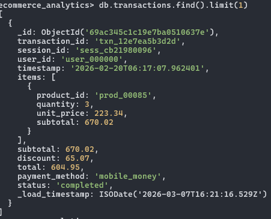
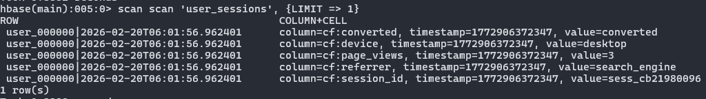
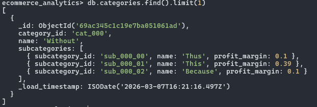
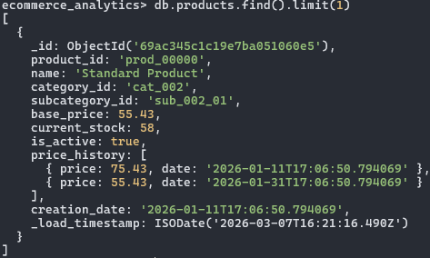
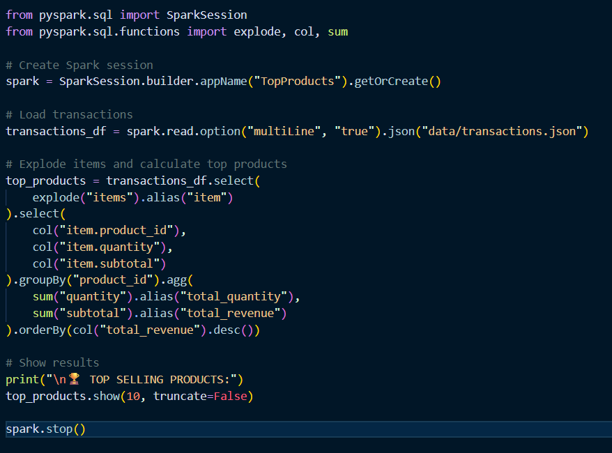
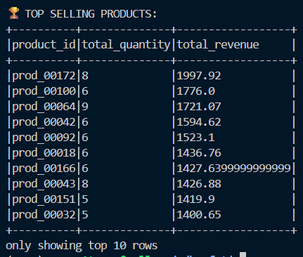
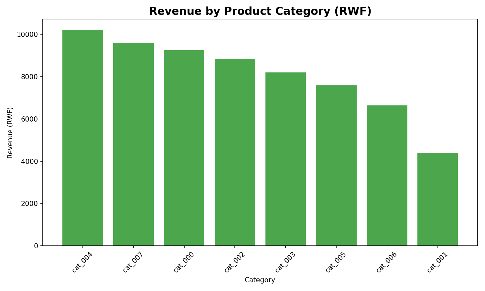
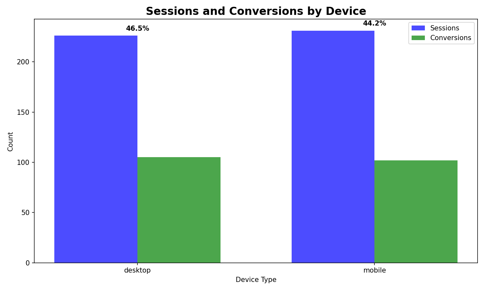

## ADVANCED DATABASE DESING AND IMPLEMENTATION FINAL ASSESSMENT TEST - SANGARE BEN AZIZ - 202540330

## Date: 08/03/2026

# SECTION A

# QUESTION 1: 
## a- Explain the differences between document databases and wide-column databased using examples from MongoDB and Apache HBase: 

Working with both MongoDB and HBase for this e-commerce dataset helped me see how MongoDB and HBase are different.

With MongoDB, everything is stored as JSON-like documents. For example, when I load the user data, I could just put all the information in one document 

with nested fields like geo_data containing city and state. The same for sessions, I could embed page_views and cart_contents directly inside the session 

document. And because of that ebedment, MongoDB is very flexible. If one product has a price_history array and another doesn't, it's fine. You don't have 

to define everything upfront. Querying is also straightforward with the aggregation pipeline, even though the sintax is not easy to understand.

HBase is a different story. It's a wide-column store and I think is more difficult than the MongoDB. You have to think about your row keys carefully 

because that's how you'll access the data. For my user_sessions table, I used user_id|timestamp as the row key so I could quickly get all sessions for a 

specific user in reverse chronological order. For product_metrics, I used product_id|date to track daily performance. Unlike MongoDB where you can query 

any field, in HBase you really need to know your access patterns in advance. It feels less flexible but apparently it scales better for time-series data. 

I can see how it would be useful if you're dealing with millions of sessions per day and you just need to scan recent activity for specific users.

So In conclusion, MongoDB is great when you have complex, nested data and need to query it in different ways. HBase is better when you have predictable 

access patterns and need to handle massive amounts of time-series data efficiently.

## b- Discuss the advantages of using Apache Spark for processing large-scale e-commerce datasets:

For the Spark part of this project, I used PySpark to process the JSON files and this is much fater than using pandas, especially when I increased the 

dataset size. According to my research, the reason is because Spark distributes the processing across multiple cores, so it can handle much larger 

datasets without crashing.

Another useful this is that Spark can read all the JSON files directly such as users, products, sessions, transactions and join them together even though 

they come from different sources. For the part of finding products frequently bought together, I had to join the transaction data with itself, which 

would have been slow and complicated with regular Python. Spark made it manageable even on my laptop.

The documentation (https://spark.apache.org/docs/latest/quick-start.html) says Spark can also integrate with MongoDB and HBase directly using connectors, 

but I didn't have time to set that up. Still, just being able to load the JSON exports and process them in Spark was enough to see the performance 

benefits.

## c- Explain why NoSQL databases are suitable for handling big data in modern e-commerce systems:

After working with MongoDB and HBase for this project, I can see why e-commerce sites use NoSQL databases instead of just traditional SQL databases.

First, the data itself doesn't fit neatly into tables. If you look at one session in our dataset, it has page views, cart contents, user geo data, device 

profile and more nested fields. In a relational database, you'd need like 10 different tables with foreign keys everywhere and complex joins to 

reconstruct a single session. With MongoDB, I just store the whole session as one document. When I need to analyze a user journey, I get everything in 

one read operation.

Second, different types of data have different access patterns. User profiles and product catalogs work well in MongoDB because they're 

document-oriented. Session browsing data works better in HBase because it's time-series and you're often scanning recent activity. Using the right 

database for each type of data makes the whole system more efficient.

Third, schema flexibility is important and complex in e-commerce. Products have different attributes, sessions have different events, user behavior 

changes over time. With NoSQL, you can add new fields without migrating millions of records or having downtime.

Finally, these databases are designed for high write loads. In e-commerce, you're constantly recording page views, cart additions, searches and that's a 

lot of writes per second. From what I read, HBase especially is optimized for this kind of write-heavy workload.

## SECTION B: Data Modeling and Database Design
## a- Design a MongoDB document schema for storing transaction data that includes multiple purchased products:

Looking at the sample transaction from the PDF and what I implemented in my own dataset, I would store each transaction as a single document with an 

array of items embedded inside. For example:    

This way when I query for a transaction I get everything in one document. I don't need to join with another collection to find out what was bought. 

## b- Propose an HBase table design for storing user browsing sessions as time-series data:

For the HBase part of my project, I created a user_sessions table exactly for this purpose. The row key design is important because it determines how 

you'll query the data later.

I used user_id|reverse_timestamp as the row key format. The reverse timestamp puts the most recent sessions first when scanning. For example:

 

For column families, I kept it simple with one family called cf (short for column families) that stores all session attributes:

cf:session_id => this shows the id of the session 
cf:device_type
cf:os
cf:browser
cf:page_views_count
cf:referrer
cf:conversion_status

If I wanted to get all sessions for a specific user in the last week, I could do a scan with start and end row keys based on the user_id prefix and 

timestamp range. The design makes time-range scans efficient because related data is stored together physically.

## c- Explain advantages of embedding product items inside transaction documents in MongoDB:

From working with the e-commerce data, I found three main advantages to embedding items:

First, performance. When I needed to calculate things like total revenue or average order value, having the items right there in the transaction document 

meant MongoDB could do everything in one pass without joins. My aggregation pipelines were much simpler.

Second, data locality. In e-commerce, when you look at a transaction you almost always want to see what was bought. If items were in a separate 

collection, every transaction query would need an extra lookup. With embedding, one read gets everything.

Third, atomicity. If I need to update a transaction like for example changing the status from "shipped" to "delivered", the entire transaction including 

its items is updated together. There's no risk of the transaction document updating but the items collection failing to update.

## d- Describe how product categories and subcategories can be modeled efficiently in MongoDB:

In my implementation, I stored categories in their own collection with subcategories embedded. Each category document looks like:

 

Then in my products collection, I just reference the category and subcategory IDs:
 
 

This avoids duplicating category names and profit margins across thousands of products. When I need category information for a product, I do a lookup. 

But since categories don't change often, I could also cache them or even denormalize the category name into products if query speed was critical. For 

this project, the lookup approach worked fine and kept my data normalized.

## SECTION c: Data Processing and Analytics
## a- Using PySpark, explain how you would calculate the top-selling product based on transaction data

For this I would need to join transactions with the items inside them. In my dataset, transactions have an items array, so first I'd need to explode that 

array to get each product as its own row. Something like:

 

And the result would be as followed: 

 

## b- Describe how Spark SQL can be used to perform analytical queries on e-commerce datasets

Spark SQL is useful because you can register your DataFrames as temporary views and then just write SQL queries if that's what you're more comfortable 

with. For example, after loading my transactions and products data:

# Register as views
transactions_df.createOrReplaceTempView("transactions")

products_df.createOrReplaceTempView("products")

# Now I can use SQL

results = spark.sql("""
    SELECT p.category_id, 
           COUNT(DISTINCT t.transaction_id) as order_count,
           SUM(t.total) as revenue
    FROM transactions t
    JOIN products p ON t.product_id = p.product_id
    GROUP BY p.category_id
    ORDER BY revenue DESC
""")

And Spark SQL can handles large datasets that would crash traditional databases, and the syntax is familiar. I can do complex joins, window functions, 

subqueries, basically anything I'd do in PostgreSQL but distributed. For my project case, I used Spark SQL to group users by registration month and track 

their purchases over time.

# c- Explain how to perform customer segmentation analysis using data from users, sessions, and transactions

Customer segmentation is about grouping customers based on their behavior. For this project, I would combine data from all three collections to create 

customer profiles.

First, from transactions, I'd calculate:

    -Total spent (monetary value)

    -Number of orders (frequency)

    -Average order value

    -First purchase date and last purchase date (recency)

From sessions, I'd calculate:

    -Total sessions per user

    -Average session duration

    -Conversion rate (sessions that led to purchase / total sessions)

    -Devices used (mobile vs desktop users)

From users, I'd use:

    -Geographic location (city/province)

    =Account age (how long they've been registered)

Then I'd join all this into one customer DataFrame and create segments based on business rules. For example:

customer_segments = customer_data.withColumn(
    "segment",
    when((col("total_spent") > 100000) & (col("order_count") > 5), "VIP")
    .when((col("total_spent") > 50000) & (col("order_count") > 2), "Regular")
    .when((col("total_spent") > 0), "Active")
    .otherwise("Inactive")
)

In the PDF they mentioned RFM analysis (Recency, Frequency, Monetary) which is perfect for this. I'd score customers on each dimension and then combine 

scores to create segments like "Champions", "Loyal Customers", "At Risk", etc. This helps the business know who to target with promotions, who needs 

re-engagement, and who their best customers are.

# d- Suggest two useful data visualizations that could help managers understand sales performance and customer behavior

From the visualizations I created in this project, I would recommend two that give managers different perspectives on the business:

# Visualization 1: Revenue by Category for sales performance

This bar chart shows which product categories generate the most revenue. From my Rwanda dataset, it clearly shows that Agriculture products (like coffee 

and bananas) and Artisanat (traditional crafts like Agaseke baskets) are the top performers. A manager looking at this can immediately see where to focus 

marketing efforts or inventory investment. If Agriculture is growing but Artisanat is flat, they might investigate why and adjust promotions accordingly. 

It's simple but gives a clear picture of where the money is coming from.

# Visualization 2: Device Performance with Conversion Rates for customer behavior

This grouped bar chart shows sessions and conversions by device type (mobile, desktop, tablet). What makes it useful is that it doesn't just show traffic 

but it also shows behavior. In my data, mobile might have the most sessions but desktop could have higher conversion rates. A manager seeing this might 

decide to optimize the mobile checkout experience because that's where most customers are, or they might push desktop promotions because those users are 

more likely to buy. The conversion rate numbers on top of the bars make it easy to compare performance across devices.