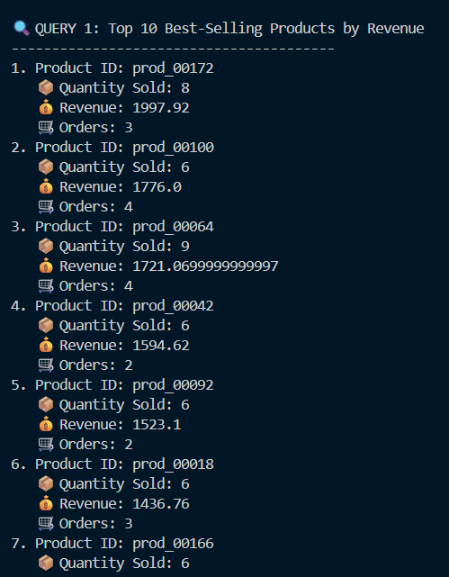
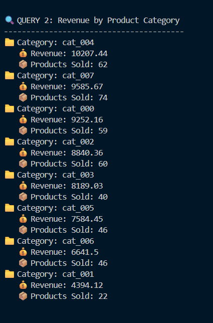
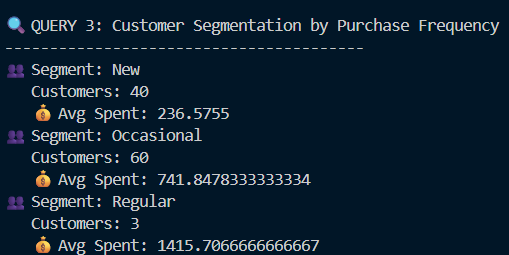

# ULK Software Engineering
## Advanced Database Design and Implementation Final Assessment Test
### Burkina Faso E-commerce Analytics System

**Student Name:** SANGARE BEN AZIZ - 202540330
**Date:** March 8, 2026

-

## 1. Dataset Generation

A synthetic e-commerce dataset was generated using a custom Python script (`dataset.py`).  
The dataset simulates user interactions, product browsing behavior, and purchase transactions over a **90-day activity period**.

The generated dataset includes the following entities:

- Users
- Products
- Categories and subcategories
- Sessions
- Transactions

To simulate realistic geographic behavior, all user location data corresponds to **cities in Burkina Faso**, including Ouagadougou, Bobo-Dioulasso, and Banfora.

### Dataset Relationships

The following relationships were implemented:

User → Sessions → Transactions  
A user can have multiple browsing sessions. A session may lead to a transaction.

Products → Categories → Subcategories  
Products belong to a hierarchical category structure.

Sessions → Products → Cart → Transactions  
Sessions track viewed products and cart activity which may result in purchases.

### Dataset Size

The generated dataset contains:

- 120 users
- 200 products
- 8 categories
- ~450 sessions
- ~150 transactions

## 2. MongoDB Data Storage

The generated dataset was loaded into MongoDB using the `loadtomongo.py` script.

The following collections were created:

- users
- products
- categories
- sessions
- transactions

Each document was augmented with a `_load_timestamp` field to track ingestion time.

Indexes were created to improve query performance, including:

- unique index on `user_id`
- unique index on `product_id`
- unique index on `session_id`
- unique index on `transaction_id`

## 3. MongoDB Data Modeling

MongoDB was selected as the primary document-oriented database for storing the core e-commerce dataset. Its flexible schema design allows hierarchical and semi-structured data to be represented efficiently without strict relational constraints.

The database contains five main collections:

- users
- products
- categories
- sessions
- transactions

Each collection represents a specific entity within the e-commerce system.

### 3.1 Product Catalog Model

The product catalog is represented using two collections: **categories** and **products**.

Categories contain embedded subcategories to represent the hierarchical structure of the catalog. This approach allows efficient retrieval of all subcategories within a category without requiring additional joins.

Example category document:

{
  "category_id": "cat_003",
  "name": "Electronics",
  "subcategories": [
    {
      "subcategory_id": "sub_003_01",
      "name": "Mobile Accessories",
      "profit_margin": 0.22
    }
  ]
}

Products reference their category and subcategory identifiers. This reference-based approach prevents duplication of category data across many product documents.

Example product document:

{
  "product_id": "prod_00045",
  "name": "Wireless Charger",
  "category_id": "cat_003",
  "subcategory_id": "sub_003_01",
  "base_price": 29.99,
  "current_stock": 120,
  "is_active": true
}

This hybrid modeling strategy (embedding + referencing) ensures both efficient catalog browsing and minimal data redundancy.

### 3.2 User Profile Model

User information is stored in the **users** collection. Each document contains a unique identifier and basic geographic information.

Example user document:

{
  "user_id": "user_000042",
  "geo_data": {
    "city": "Ouagadougou",
    "state": "Kadiogo",
    "country": "BF"
  },
  "registration_date": "2025-01-10T09:32:00"
}

User behavioral data (sessions and purchases) is stored separately to avoid excessively large documents.

### 3.3 Session Model

The **sessions** collection stores browsing activity. Each session document records user interactions including viewed products, page navigation, and cart activity.

Example session document:

{
  "session_id": "sess_a7b3c9d8",
  "user_id": "user_000042",
  "start_time": "2025-03-12T14:37:22",
  "viewed_products": ["prod_00123", "prod_02456"],
  "cart_contents": {
    "prod_00123": {
      "quantity": 2,
      "price": 129.99
    }
  }
}

Sessions are stored separately because they represent time-series behavioral data that can grow rapidly.

### 3.4 Transaction Model

Completed purchases are stored in the **transactions** collection.

Each transaction embeds the purchased items directly inside the transaction document. This design ensures that all purchase information is stored together, allowing efficient retrieval for revenue analysis.

Example transaction document:

{
  "transaction_id": "txn_c8d9e7f3",
  "session_id": "sess_a7b3c9d8",
  "user_id": "user_000042",
  "items": [
    {
      "product_id": "prod_00123",
      "quantity": 2,
      "unit_price": 129.99
    }
  ],
  "total": 259.98
}

Embedding line items inside transactions is beneficial because the items are only relevant within the context of that transaction.

### PART 1: DATA MODELING AND STORAGE
### I. MongoDB Implementation

MongoDB aggregation pipelines were implemented to perform analytical queries directly on the stored dataset.

## Product Popularity Analysis

This query identifies the most popular products based on total sales revenue and quantity sold. The pipeline first unwinds the transaction line items, then groups results by product identifier.

## Revenue Analytics by Category

A second pipeline calculates total revenue generated by each product category. This is achieved by joining transaction line items with the product catalog using the `$lookup` operator.

## Customer Segmentation

Customer purchasing behavior was analyzed by grouping transactions by user and calculating total order counts. Users were segmented into different categories based on their purchase frequency.

### II. HBase Implementation for Time-Series Analytics

While MongoDB was used to store the main e-commerce entities such as users, products, and transactions, HBase was selected to store time-series behavioral data generated from user browsing sessions.

User interaction logs such as page views, device information, and traffic sources generate large volumes of sequential event data. HBase is well suited for this type of workload because it is a distributed column-oriented database built on top of HDFS, allowing efficient storage and retrieval of very large datasets.

Two tables were designed for this component of the system: user_sessions & product_metrics

These tables enable the storage of behavioral analytics data and aggregated product metrics for time-based analysis.
## User Sessions Table

The user_sessions table stores browsing activity generated during each user session.

The row key was designed as:

- user_id | timestamp

This design groups all sessions belonging to the same user together while preserving chronological order. As a result, retrieving a user's browsing history or analyzing behavioral patterns over time becomes efficient.

A single column family named cf was created to store session attributes.

Stored columns include:

-session_id – unique identifier of the browsing session

-device – device type used during the session

-page_views – number of pages visited

-referrer – traffic source (search engine, social media, etc.)

-converted – indicates whether the session resulted in a purchase

This schema supports analytical queries such as:

-retrieving browsing history for a specific user

-analyzing conversion behavior

-studying traffic sources and user engagement patterns

Table Creation Command
create 'user_sessions', 'cf'
Example Query

-Retrieve recent browsing sessions:

scan 'user_sessions', {LIMIT => 3}

-Retrieve a specific user session:

get 'user_sessions', 'user_000000|2026-02-20T06:01:56.962401'

## Product Metrics Table

The product_metrics table stores aggregated performance statistics for products over time.

The row key is designed as:

-product_id | date

This structure enables efficient retrieval of product performance metrics for specific time periods.

Two column families were defined:

-daily

-weekly

These column families store aggregated metrics such as:

-product views

-add-to-cart events

-completed purchases

By organizing metrics at different temporal granularities, the system supports analytics tasks such as:

-monitoring product popularity trends

-identifying high-performing products

-analyzing demand changes over time

Table Creation Command
create 'product_metrics', 'daily', 'weekly'

Example query:

scan 'product_metrics'

## Why MongoDB and HBase Were Used Together

MongoDB and HBase serve different roles within the analytics architecture.

MongoDB is used to store core transactional and catalog data, including users, products, and transactions. Its document-oriented model is well suited for hierarchical and semi-structured data.

HBase is used to store high-volume time-series behavioral data, such as browsing sessions and activity logs. Its column-oriented architecture allows efficient storage and retrieval of large-scale event data.

By combining both technologies, the system can efficiently manage both structured transactional data and large-scale behavioral analytics data.

### Big Data Analytics Report

## Spark Batch Processing – Burkina Faso E-Commerce Dataset
1. Introduction

This project analyzes an e-commerce dataset from Burkina Faso using Apache Spark to identify customer behavior patterns, purchasing trends, and device performance metrics.

The analysis was implemented using PySpark and processed the following datasets:

-Users: 120

-Products: 200

-Sessions: 457

Spark batch processing was used to perform large-scale analytics including product affinity analysis, customer lifetime value estimation, device conversion analysis, and cohort analysis.

2. Product Affinity Analysis

Product affinity analysis identifies products frequently purchased together in the same transaction.

Top Product Pairs Bought Together
Product X	Product Y	Times Bought Together
prod_00021	prod_00193	1
prod_00043	prod_00063	1
prod_00077	prod_00121	1
prod_00005	prod_00096	1
prod_00058	prod_00124	1

Insights:

-The dataset shows low frequency co-purchases, indicating highly diverse buying behavior.

-This analysis can help build recommendation systems such as: “Customers who bought this also bought…”